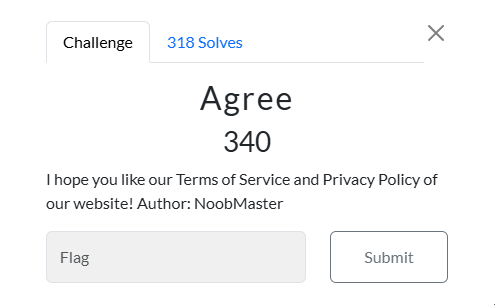
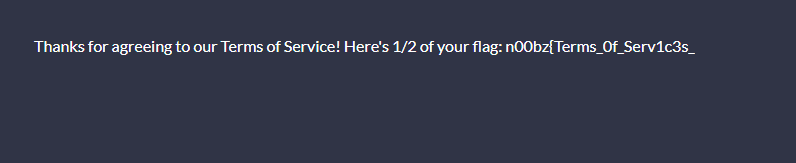
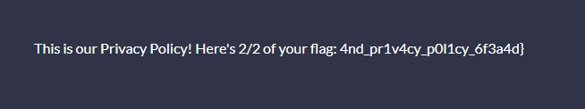

# Agree



I spent a considerable amount of time on this challenge. I kept searching the ctf website for a terms of services and privacy policy, but came up short. I then looked at the source code for the website, searching anything in the code that would point me to a terms of service page and a privacy policy page. But it was all for naught. In a last ditch effort, I changed the URL from `ctf.n00bzunit3d.xyz` to `ctf.n00bzunit3d.xyz/tos`, which resulted in:




```txt
Thanks for agreeing to our Terms of Service! Here's 1/2 of your flag: n00bz{Terms_0f_Serv1c3s_
```

I then changed the URL from ` ctf.n00bzunit3d.xyz` to ` ctf.n00bzunit3d.xyz/privacy`, which resulted in:


 
```txt
This is our Privacy Policy! Here's 2/2 of your flag: 4nd_pr1v4cy_p0l1cy_6f3a4d}
```
I then submitted ` n00bz{Terms_0f_Serv1c3s_4nd_pr1v4cy_p0l1cy_6f3a4d}`, and solved the challenge.

