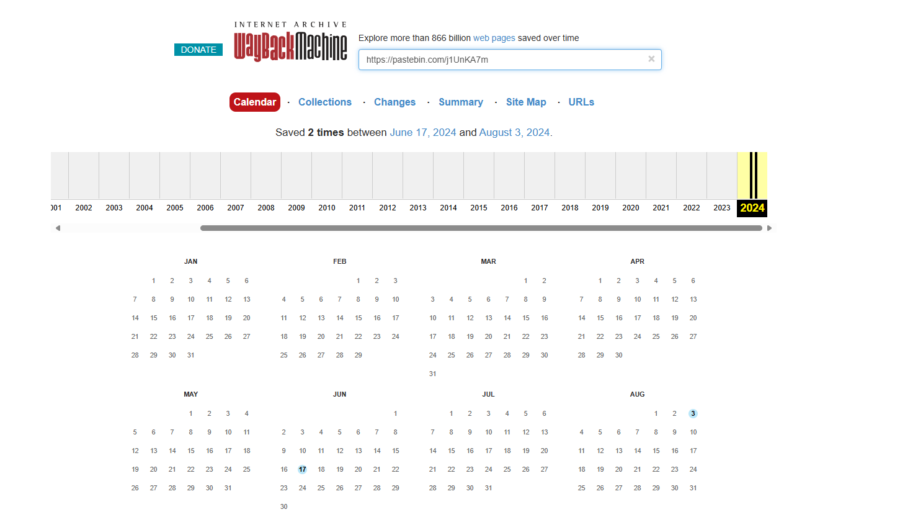
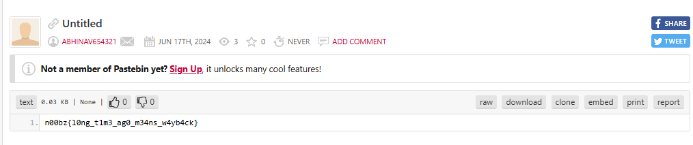

# Pastebin

Since the pastebin was created a "long time ago", I entered the link into the Wayback Machine:

 
I then clicked on August 3rd:

 
I noticed that the actual URL of the pastebin has two captures, so I clicked on `2 captures`:

 
I then clicked on June 17, which resulted in:

 
I then submitted ` n00bz{l0ng_t1m3_ag0_m34ns_w4yb4ck}`, and solved the challenge.

