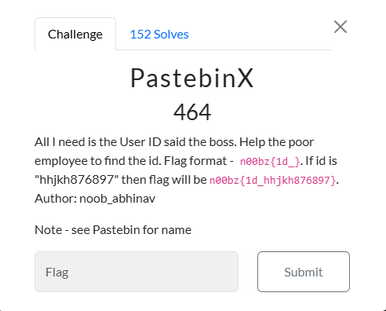
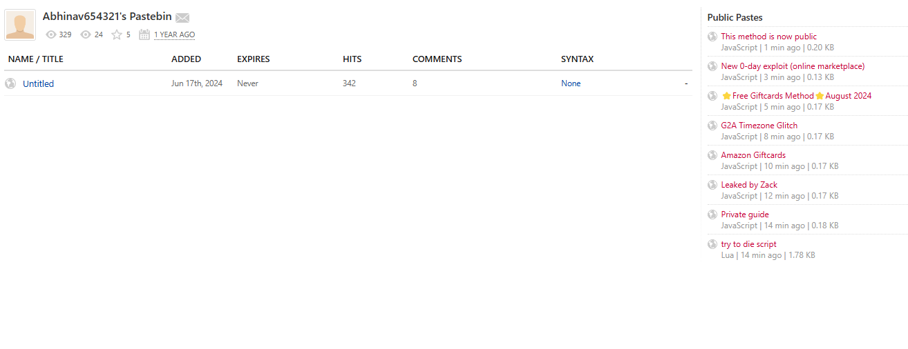
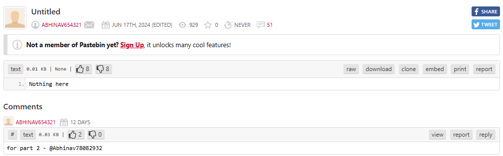
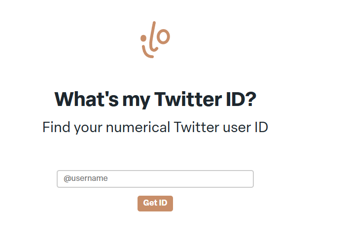
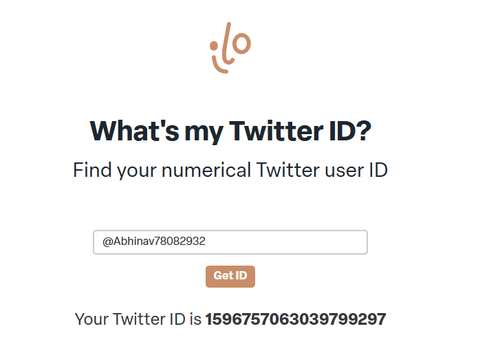

# PastebinX

I went back to the Wayback Machine, and entered the link from the `Pastebin` challenge. I then clicked on August 3rd: 

 
I then click on `Untitled`, which resulted in:
 

I searched `Twitter User ID from username` on Google, and found ` ilo.so/twitter-id/`:
 

I then entered `@Abhinav78082932`, which resulted in:
 

I then submitted `n00bz{1d_1596757063039799297}`, and solved the challenge.

