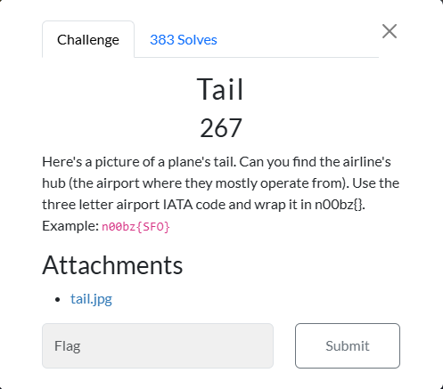
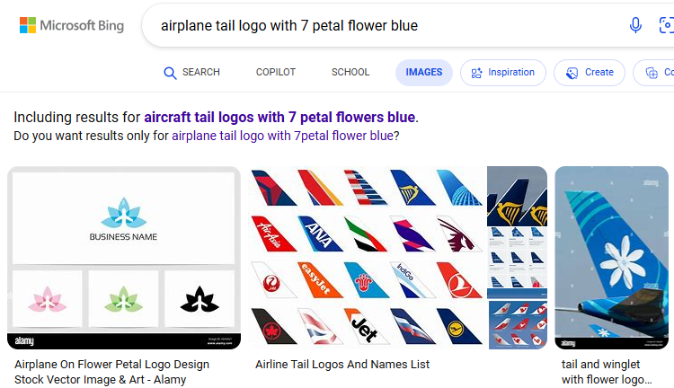
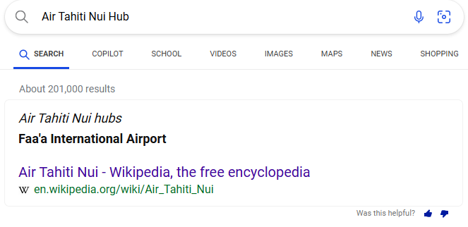
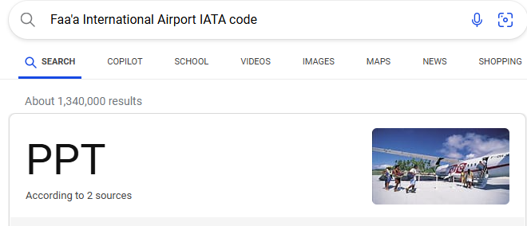

# Tail

I clicked on `tail.jpeg`, which resulted in this image being displayed in my browser:

 
The airplane tail had an image of a flower with 7 petals, which gave me an identifying trait of the plane. So, I searched up “airplane tail logo with 7 petal flower blue” on Bing Images in an attempt to find the airline that owned the plane:

 
I then clicked on `tail and winglet with flower logo`, which resulted in this image being shown under `Related Images`:

 
Now knowing that the airline that owns the plane was `Air Tahiti Nui`, I now needed to find their hub airport, so I searched `Air Tahiti Nui Hub`, which resulted in:

 
Now knowing that the hub airport of Air Tahiti Nui was Faa’a International Airport, I now needed to find the IATA code of Faa’a International Airport. So, I searched `Faa’a International Airport IATA code` on Google, which resulted in:

 
I then submitted `n00bz{PPT}`, and solve the challenge.

