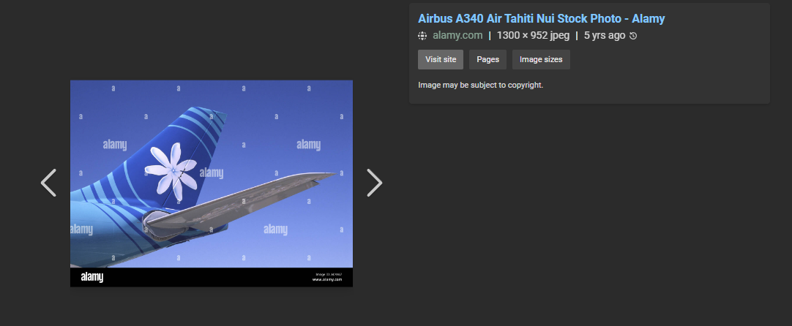

# Tail

This is the image:

 
Search up “airplane tail logo with 7 petal flower blue” on bing images:

 
Would you look at that?
Click on the similar image results in this related image being shown down below:

 
Now just need to find `Air Tahiti Nui`’s hub, so search `Air Tahiti Nui Hub`

 
Now just need to find the IATA code of Faa’a International Airport, so I search `Faa’a International Airport IATA code`, which results in:

 
PPT. I then submit `n00bz{PPT}` and solve the challenge.

