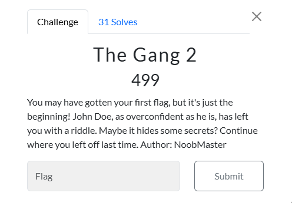
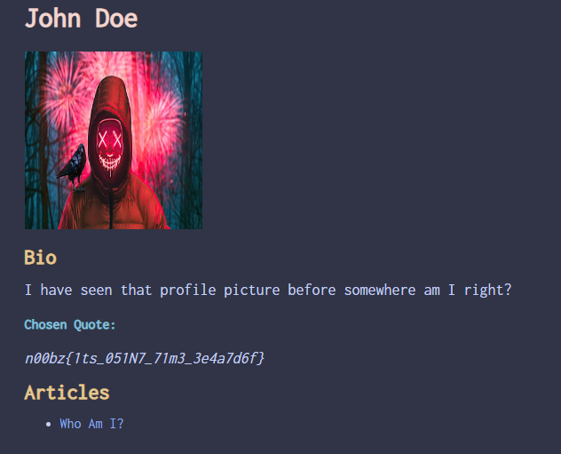
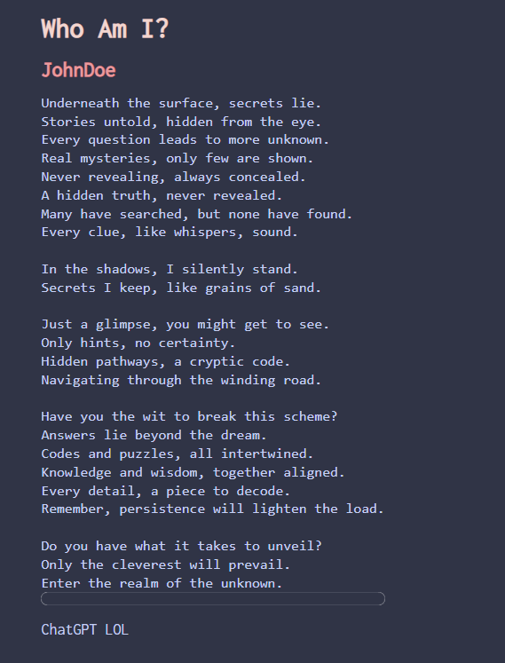
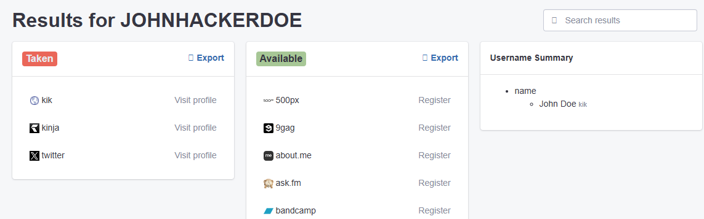
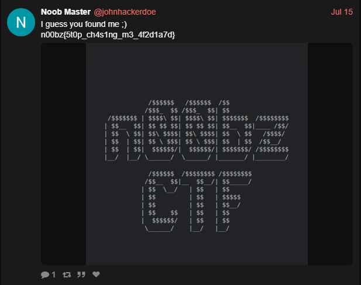

# The Gang 2



I went back to John Doe's profile on `n00bzunit3d.xyz`:



Seeing that he wrote an article, I clicked on it, which resulted in:



I noticed that the first letters of each sentence seemed to be spelling something out, so I combined them to get:

```txt
USERNAME IS JOHN HACKER DOE
```


I then searched up `username lookup` on Google, and came across `analyzeid`. I tried entering:

```txt
John Hacker Doe
john hacker doe
johnhackerdoe
```

But nothing came up. However, when I entered:

```txt
JOHNHACKERDOE
```

I was greeted with:


 
I then went to the `JOHNHACKERDOE` X.com account, where one of the tweets caught my eye:


 
I then submitted `n00bz{5t0p_ch4s1ng_m3_4f2d1a7d}`, and solved the challenge.


