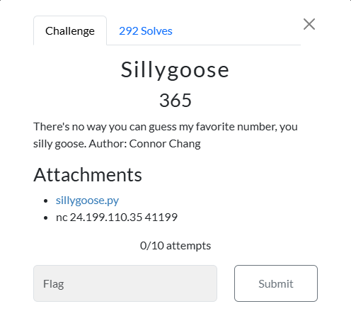

# Sillygoose



I clicked on `sillygoose.py`, which took me to a webpage that contained:

```txt
from random import randint
import time
ans = randint(0, pow(10, 100))
start_time = int(time.time())
turns = 0
while True:
    turns += 1

    inp = input()

    if int(time.time()) > start_time + 60:
       print("you ran out of time you silly goose") 
       break

    if "q" in inp:
        print("you are no fun you silly goose")
        break

    if not inp.isdigit():
        print("give me a number you silly goose")
        continue

    inp = int(inp)
    if inp > ans:
        print("your answer is too large you silly goose")
    elif inp < ans:
        print("your answer is too small you silly goose")
    else:
        print("congratulations you silly goose")
        f = open("/flag.txt", "r")
        print(f.read())

    if turns > 500:
        print("you have a skill issue you silly goose")
```

Since I have a limited amount of time to guess the correct number, I must program a script to guess the number for me. With any challenge that requires scripting, I first prompt ChatGPT to solve it for me. If ChatGPT is unable to solve it, I then move toward using ChatGPT's code as a base for me to work from. So, I craft this ChatGPT prompt: 

`
from random import randint import time ans = randint(0, pow(10, 100)) start_time = int(time.time()) turns = 0 while True: turns += 1 inp = input() if int(time.time()) > start_time + 60: print("you ran out of time you silly goose") break if "q" in inp: print("you are no fun you silly goose") break if not inp.isdigit(): print("give me a number you silly goose") continue inp = int(inp) if inp > ans: print("your answer is too large you silly goose") elif inp < ans: print("your answer is too small you silly goose") else: print("congratulations you silly goose") f = open("/flag.txt", "r") print(f.read()) if turns > 500: print("you have a skill issue you silly goose") Reverse engineer this code to obtain the flag, while connecting it to 24.199.110.35 41199
`

I then sent the prompt, which resulted in this script:

```txt
import socket
import time

# Define the server address and port
server_address = '24.199.110.35'
server_port = 41199

# Create a socket connection to the server
sock = socket.socket(socket.AF_INET, socket.SOCK_STREAM)
sock.connect((server_address, server_port))

# Function to receive data from the server
def receive_data():
    data = sock.recv(4096).decode()
    print(data)
    return data

# Function to send data to the server
def send_data(message):
    sock.sendall((message + '\n').encode())

# Initialize binary search bounds
low = 0
high = pow(10, 100)

# Initialize start time
start_time = time.time()

while True:
    if time.time() > start_time + 60:
        print("Timeout: you ran out of time.")
        break

    guess = (low + high) // 2
    send_data(str(guess))
    response = receive_data()

    if "congratulations" in response:
        # We've found the correct answer
        print("Congratulations! You've guessed the correct number.")
        flag = receive_data()  # Assuming the flag is sent after the success message
        print("Flag:", flag)
        break
    elif "too large" in response:
        high = guess - 1
    elif "too small" in response:
        low = guess + 1
    elif "ran out of time" in response or "you have a skill issue" in response or "you are no fun" in response:
        # Exit conditions as defined by the server
        break

# Close the socket connection
sock.close()
```

I then copied and pasted the script into a python file, which I named `sillygoosesolve.py` and ran it, which resulted in:

```txt
your answer is too large you silly goose

your answer is too small you silly goose

your answer is too large you silly goose

your answer is too large you silly goose

your answer is too small you silly goose

your answer is too small you silly goose

your answer is too large you silly goose

your answer is too small you silly goose

your answer is too small you silly goose

your answer is too small you silly goose

your answer is too large you silly goose

your answer is too large you silly goose

your answer is too small you silly goose

your answer is too small you silly goose

your answer is too small you silly goose

your answer is too large you silly goose

your answer is too small you silly goose

your answer is too small you silly goose

your answer is too small you silly goose

your answer is too small you silly goose

your answer is too large you silly goose

your answer is too large you silly goose

your answer is too large you silly goose

your answer is too small you silly goose

your answer is too large you silly goose

your answer is too large you silly goose

your answer is too large you silly goose

your answer is too large you silly goose

your answer is too small you silly goose

your answer is too large you silly goose

your answer is too large you silly goose

your answer is too large you silly goose

your answer is too small you silly goose

your answer is too large you silly goose

your answer is too large you silly goose

your answer is too large you silly goose

your answer is too small you silly goose

your answer is too small you silly goose

your answer is too large you silly goose

your answer is too small you silly goose

your answer is too small you silly goose

your answer is too large you silly goose

your answer is too large you silly goose

your answer is too large you silly goose

your answer is too small you silly goose

your answer is too small you silly goose

your answer is too small you silly goose

your answer is too small you silly goose

your answer is too small you silly goose

your answer is too small you silly goose

your answer is too small you silly goose

your answer is too small you silly goose

your answer is too small you silly goose

your answer is too small you silly goose

your answer is too large you silly goose

your answer is too large you silly goose

your answer is too small you silly goose

your answer is too large you silly goose

your answer is too small you silly goose

your answer is too large you silly goose

your answer is too large you silly goose

your answer is too small you silly goose

your answer is too small you silly goose

your answer is too large you silly goose

your answer is too large you silly goose

your answer is too large you silly goose

your answer is too large you silly goose

your answer is too large you silly goose

your answer is too small you silly goose

your answer is too large you silly goose

your answer is too small you silly goose

your answer is too small you silly goose

your answer is too large you silly goose

your answer is too small you silly goose

your answer is too small you silly goose

your answer is too small you silly goose

your answer is too large you silly goose

your answer is too small you silly goose

your answer is too large you silly goose

your answer is too large you silly goose

your answer is too large you silly goose

your answer is too small you silly goose

your answer is too large you silly goose

your answer is too large you silly goose

your answer is too large you silly goose

your answer is too small you silly goose

your answer is too small you silly goose

your answer is too large you silly goose

your answer is too large you silly goose

your answer is too large you silly goose

your answer is too small you silly goose

your answer is too large you silly goose

your answer is too large you silly goose

your answer is too large you silly goose

your answer is too large you silly goose

your answer is too large you silly goose

your answer is too small you silly goose

your answer is too small you silly goose

your answer is too small you silly goose

your answer is too large you silly goose

your answer is too small you silly goose

your answer is too large you silly goose

your answer is too large you silly goose

your answer is too small you silly goose

your answer is too small you silly goose

your answer is too small you silly goose

your answer is too small you silly goose

your answer is too small you silly goose

your answer is too large you silly goose

your answer is too small you silly goose

your answer is too small you silly goose

your answer is too large you silly goose

your answer is too large you silly goose

your answer is too small you silly goose

your answer is too small you silly goose

your answer is too large you silly goose

your answer is too large you silly goose

your answer is too small you silly goose

your answer is too large you silly goose

your answer is too large you silly goose

your answer is too small you silly goose

your answer is too large you silly goose

your answer is too small you silly goose

your answer is too large you silly goose

your answer is too small you silly goose

your answer is too small you silly goose

your answer is too small you silly goose

your answer is too large you silly goose

your answer is too small you silly goose

your answer is too large you silly goose

your answer is too large you silly goose

your answer is too small you silly goose

your answer is too small you silly goose

your answer is too small you silly goose

your answer is too small you silly goose

your answer is too large you silly goose

your answer is too large you silly goose

your answer is too large you silly goose

your answer is too small you silly goose

your answer is too small you silly goose

your answer is too small you silly goose

your answer is too small you silly goose

your answer is too small you silly goose

your answer is too large you silly goose

your answer is too large you silly goose

your answer is too large you silly goose

your answer is too small you silly goose

your answer is too small you silly goose

your answer is too small you silly goose

your answer is too small you silly goose

your answer is too small you silly goose

your answer is too large you silly goose

your answer is too small you silly goose

your answer is too small you silly goose

your answer is too small you silly goose

your answer is too small you silly goose

your answer is too small you silly goose

your answer is too small you silly goose

your answer is too small you silly goose

your answer is too small you silly goose

your answer is too large you silly goose

your answer is too small you silly goose

your answer is too small you silly goose

your answer is too small you silly goose

your answer is too small you silly goose

your answer is too small you silly goose

your answer is too small you silly goose

your answer is too small you silly goose

your answer is too small you silly goose

your answer is too small you silly goose

your answer is too small you silly goose

your answer is too large you silly goose

your answer is too small you silly goose

your answer is too large you silly goose

your answer is too small you silly goose

your answer is too small you silly goose

your answer is too small you silly goose

your answer is too large you silly goose

your answer is too large you silly goose

your answer is too small you silly goose

your answer is too large you silly goose

your answer is too small you silly goose

your answer is too small you silly goose

your answer is too large you silly goose

your answer is too large you silly goose

your answer is too small you silly goose

your answer is too large you silly goose

your answer is too large you silly goose

your answer is too large you silly goose

your answer is too small you silly goose

your answer is too large you silly goose

your answer is too small you silly goose

your answer is too large you silly goose

your answer is too small you silly goose

your answer is too small you silly goose

your answer is too large you silly goose

your answer is too large you silly goose

your answer is too large you silly goose

your answer is too large you silly goose

your answer is too large you silly goose

your answer is too small you silly goose

your answer is too small you silly goose

your answer is too small you silly goose

your answer is too large you silly goose

your answer is too small you silly goose

your answer is too small you silly goose

your answer is too large you silly goose

your answer is too small you silly goose

your answer is too small you silly goose

your answer is too large you silly goose

your answer is too large you silly goose

your answer is too large you silly goose

your answer is too large you silly goose

your answer is too small you silly goose

your answer is too small you silly goose

your answer is too small you silly goose

your answer is too large you silly goose

your answer is too small you silly goose

your answer is too small you silly goose

your answer is too large you silly goose

your answer is too small you silly goose

your answer is too small you silly goose

your answer is too large you silly goose

your answer is too small you silly goose

your answer is too large you silly goose

your answer is too large you silly goose

your answer is too large you silly goose

your answer is too small you silly goose

your answer is too large you silly goose

your answer is too small you silly goose

your answer is too small you silly goose

your answer is too small you silly goose

your answer is too large you silly goose

your answer is too small you silly goose

your answer is too small you silly goose

your answer is too large you silly goose

your answer is too small you silly goose

your answer is too small you silly goose

your answer is too small you silly goose

your answer is too large you silly goose

your answer is too large you silly goose

your answer is too small you silly goose

your answer is too large you silly goose

your answer is too large you silly goose

your answer is too small you silly goose

your answer is too large you silly goose

your answer is too large you silly goose

your answer is too small you silly goose

your answer is too large you silly goose

your answer is too large you silly goose

your answer is too large you silly goose

your answer is too small you silly goose

your answer is too small you silly goose

your answer is too large you silly goose

your answer is too small you silly goose

your answer is too large you silly goose

your answer is too large you silly goose

your answer is too small you silly goose

your answer is too large you silly goose

your answer is too small you silly goose

your answer is too large you silly goose

your answer is too small you silly goose

your answer is too small you silly goose

your answer is too large you silly goose

your answer is too small you silly goose

your answer is too large you silly goose

your answer is too small you silly goose

your answer is too small you silly goose

your answer is too large you silly goose

your answer is too large you silly goose

your answer is too small you silly goose

your answer is too small you silly goose

your answer is too small you silly goose

your answer is too small you silly goose

your answer is too small you silly goose

your answer is too large you silly goose

your answer is too small you silly goose

your answer is too small you silly goose

your answer is too small you silly goose

your answer is too large you silly goose

your answer is too large you silly goose

your answer is too large you silly goose

your answer is too small you silly goose

your answer is too large you silly goose

your answer is too small you silly goose

your answer is too large you silly goose

your answer is too large you silly goose

your answer is too small you silly goose

your answer is too small you silly goose

your answer is too small you silly goose

your answer is too large you silly goose

your answer is too large you silly goose

your answer is too small you silly goose

your answer is too large you silly goose

your answer is too large you silly goose

your answer is too small you silly goose

your answer is too small you silly goose

your answer is too large you silly goose

your answer is too large you silly goose

your answer is too small you silly goose

your answer is too small you silly goose

your answer is too large you silly goose

your answer is too large you silly goose

your answer is too small you silly goose

your answer is too large you silly goose

your answer is too large you silly goose

your answer is too large you silly goose

your answer is too large you silly goose

your answer is too small you silly goose

your answer is too large you silly goose

your answer is too small you silly goose

your answer is too large you silly goose

your answer is too large you silly goose

your answer is too small you silly goose

your answer is too large you silly goose

your answer is too small you silly goose

your answer is too small you silly goose

your answer is too large you silly goose

your answer is too small you silly goose

your answer is too large you silly goose

your answer is too small you silly goose

your answer is too small you silly goose

your answer is too small you silly goose

your answer is too large you silly goose

your answer is too small you silly goose

your answer is too small you silly goose

your answer is too small you silly goose

your answer is too small you silly goose

your answer is too large you silly goose

your answer is too small you silly goose

your answer is too small you silly goose

congratulations you silly goose
n00bz{y0u_4r3_4_sm4rt_51l1y_g0053}


Congratulations! You've guessed the correct number.
```

I then submitted `n00bz{y0u_4r3_4_sm4rt_51l1y_g0053}`, and solved the challenge.
