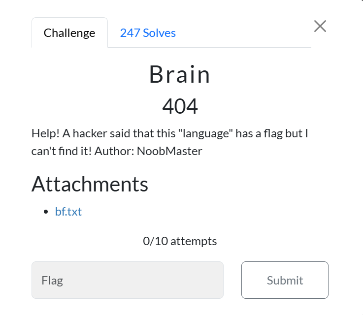

# Brain



I clicked on `bf.txt`, which took me to a webpage that displayed:
```txt
>+++++++++++[<++++++++++>-]<[-]>++++++++[<++++++>-]<[-]>++++++++[<++++++>-]<[-]>++++++++++++++[<+++++++>-]<[-]>+++++++++++++++++++++++++++++++++++++++++++++++++++++++++++++[<++>-]<[-]>+++++++++++++++++++++++++++++++++++++++++[<+++>-]<[-]>+++++++[<+++++++>-]<[-]>+++++++++++++++++++[<+++++>-]<[-]>+++++++++++[<+++++++++>-]<[-]>+++++++++++++[<++++>-]<[-]>+++++++++++[<++++++++++>-]<[-]>+++++++++++++++++++[<+++++>-]<[-]>+++++++++++[<+++++++++>-]<[-]>++++++++[<++++++>-]<[-]>++++++++++[<++++++++++>-]<[-]>+++++++++++++++++[<+++>-]<[-]>+++++++++++++++++++[<+++++>-]<[-]>+++++++[<+++++++>-]<[-]>+++++++++++[<++++++++++>-]<[-]>+++++++++++++++++++[<+++++>-]<[-]>++++++++++++++[<+++++++>-]<[-]>+++++++++++++++++++[<++++++>-]<[-]>+++++++++++++[<++++>-]<[-]>+++++++[<+++++++>-]<[-]>+++++++++++[<++++++++++>-]<[-]>+++++++++++++++++[<++++++>-]<[-]>+++++++[<++++++>-]<[-]>+++++++++++[<+++++++++>-]<[-]>+++++++++++++++++++++++++++++++++++++++++++++++++++++++++++++++++++++++++++++++++++++++++++++++++++++++++++[<+>-]<[-]>+++++++++++[<+++>-]<[-]>+++++++++++++++++++++++++[<+++++>-]<[-]
```

Since the challenge was called Brain and the file is named `bf.txt`, I could reasonably conclude that the langauge in `bf.txt` is the brainfuck coding langauge (I am not making this up that is what the actual title of the langauge is called. It's a "joke" coding langugae, not meant to ever be used seriously. It's more like "look at this crazy langauge I made").

So, I used `kvbc.github.io/bf-ide/` brainfuck IDE, which allows me to set breakpoints. I also used the "beautify" feature to make the code more readable, which resulted in:

```txt
>+++++++++++
[<++++++++++>-]
<
[-]
>++++++++
[<++++++>-]
<
[-]
>++++++++
[<++++++>-]
<
[-]
>++++++++++++++
[<+++++++>-]
<
[-]
>+++++++++++++++++++++++++++++++++++++++++++++++++++++++++++++
[<++>-]
<
[-]
>+++++++++++++++++++++++++++++++++++++++++
[<+++>-]
<
[-]
>+++++++
[<+++++++>-]
<
[-]
>+++++++++++++++++++
[<+++++>-]
<
[-]
>+++++++++++
[<+++++++++>-]
<
[-]
>+++++++++++++
[<++++>-]
<
[-]
>+++++++++++
[<++++++++++>-]
<
[-]
>+++++++++++++++++++
[<+++++>-]
<
[-]
>+++++++++++
[<+++++++++>-]
<
[-]
>++++++++
[<++++++>-]
<
[-]
>++++++++++
[<++++++++++>-]
<
[-]
>+++++++++++++++++
[<+++>-]
<
[-]
>+++++++++++++++++++
[<+++++>-]
<
[-]
>+++++++
[<+++++++>-]
<
[-]
>+++++++++++
[<++++++++++>-]
<
[-]
>+++++++++++++++++++
[<+++++>-]
<
[-]
>++++++++++++++
[<+++++++>-]
<
[-]
>+++++++++++++++++++
[<++++++>-]
<
[-]
>+++++++++++++
[<++++>-]
<
[-]
>+++++++
[<+++++++>-]
<
[-]
>+++++++++++
[<++++++++++>-]
<
[-]
>+++++++++++++++++
[<++++++>-]
<
[-]
>+++++++
[<++++++>-]
<
[-]
>+++++++++++
[<+++++++++>-]
<
[-]
>+++++++++++++++++++++++++++++++++++++++++++++++++++++++++++++++++++++++++++++++++++++++++++++++++++++++++++
[<+>-]
<
[-]
>+++++++++++
[<+++>-]
<
[-]
>+++++++++++++++++++++++++
[<+++++>-]
<
[-]
```

I noticed that the code regularly repeated the `<` character, which was interesting. So, I set breakpoints at each `<`:

```txt
>+++++++++++
[<++++++++++>-]
<#
[-]
>++++++++
[<++++++>-]
<#
[-]
>++++++++
[<++++++>-]
<#
[-]
>++++++++++++++
[<+++++++>-]
<#
[-]
>+++++++++++++++++++++++++++++++++++++++++++++++++++++++++++++
[<++>-]
<#
[-]
>+++++++++++++++++++++++++++++++++++++++++
[<+++>-]
<#
[-]
>+++++++
[<+++++++>-]
<#
[-]
>+++++++++++++++++++
[<+++++>-]
<#
[-]
>+++++++++++
[<+++++++++>-]
<#
[-]
>+++++++++++++
[<++++>-]
<#
[-]
>+++++++++++
[<++++++++++>-]
<#
[-]
>+++++++++++++++++++
[<+++++>-]
<#
[-]
>+++++++++++
[<+++++++++>-]
<#
[-]
>++++++++
[<++++++>-]
<#
[-]
>++++++++++
[<++++++++++>-]
<#
[-]
>+++++++++++++++++
[<+++>-]
<#
[-]
>+++++++++++++++++++
[<+++++>-]
<#
[-]
>+++++++
[<+++++++>-]
<#
[-]
>+++++++++++
[<++++++++++>-]
<#
[-]
>+++++++++++++++++++
[<+++++>-]
<#
[-]
>++++++++++++++
[<+++++++>-]
<#
[-]
>+++++++++++++++++++
[<++++++>-]
<#
[-]
>+++++++++++++
[<++++>-]
<#
[-]
>+++++++
[<+++++++>-]
<#
[-]
>+++++++++++
[<++++++++++>-]
<#
[-]
>+++++++++++++++++
[<++++++>-]
<#
[-]
>+++++++
[<++++++>-]
<#
[-]
>+++++++++++
[<+++++++++>-]
<#
[-]
>+++++++++++++++++++++++++++++++++++++++++++++++++++++++++++++++++++++++++++++++++++++++++++++++++++++++++++
[<+>-]
<#
[-]
>+++++++++++
[<+++>-]
<#
[-]
>+++++++++++++++++++++++++
[<+++++>-]
<#
[-]
```

I then ran the code in the IDE, and checked the memory map after each breakpoint:


1st `<`:

```txt
n
```

2nd `<`:
```txt
0
```
3rd `<`:
```txt
0
```
4th `<`:
```txt
b
```
5th `<`:
```txt
z
```
6th `<`:
```txt
{
```
`n00bz{` is the standard flag format for this competition. Additionally, after each breakpoint, the code clears the memory. I continue going through each breakpoint:

7th `<`:
```txt
1
```
8th `<`:
```txt
_
```
9th `<`:
```txt
c
```
10th `<`:
```txt
4
```
11th `<`:
```txt
n
```
12th `<`:
```txt
_
```
13th `<`:
```txt
c
```
14th `<`:
```txt
0
```
15th `<`:
```txt
d
```
16th `<`:
```txt
3
```
17th `<`:
```txt
_
```
18th `<`:
```txt
1
```
19th `<`:
```txt
n
```
20th `<`:
```txt
_
```
21st `<`:
```txt
b
```
22nd `<`:
```txt
r
```
23rd `<`:
```txt
4
```
24th `<`:
```txt
1
```
25th `<`:
```txt
n
```
26th `<`:
```txt
f
```
27th `<`:
```txt
*
```
28th `<`:
```txt
c
```
29th `<`:
```txt
k
```
30th `<`:
```txt
!
```
31st `<`:
```txt
}
```

Now to bring it all together:
n00bz{1_c4n_c0d3_1n_br41nf*ck!}


