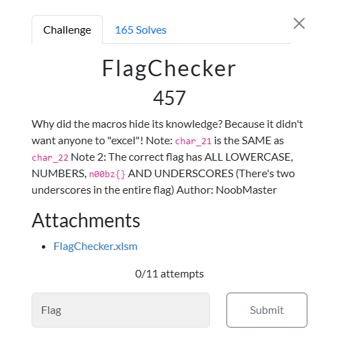
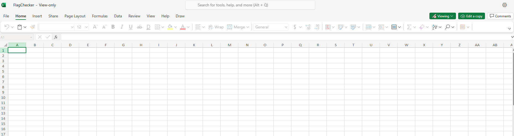

# FlagChecker



I download FlagChecker.xlsm and open it:


 
I then look at the macro code (enable developer options under the customize ribbion tab in order to do this):

```txt
Sub FlagChecker()

    Dim chars(1 To 24) As String
    guess = InputBox("Enter the flag:")
    If Len(guess) <> 24 Then
        MsgBox "Nope"
    End If
    char_1 = Mid(guess, 1, 1)
    char_2 = Mid(guess, 2, 1)
    char_3 = Mid(guess, 3, 1)
    char_4 = Mid(guess, 4, 1)
    char_5 = Mid(guess, 5, 1)
    char_6 = Mid(guess, 6, 1)
    char_7 = Mid(guess, 7, 1)
    char_8 = Mid(guess, 8, 1)
    char_9 = Mid(guess, 9, 1)
    char_10 = Mid(guess, 10, 1)
    char_11 = Mid(guess, 11, 1)
    char_12 = Mid(guess, 12, 1)
    char_13 = Mid(guess, 13, 1)
    char_14 = Mid(guess, 14, 1)
    char_15 = Mid(guess, 15, 1)
    char_16 = Mid(guess, 16, 1)
    char_17 = Mid(guess, 17, 1)
    char_18 = Mid(guess, 18, 1)
    char_19 = Mid(guess, 19, 1)
    char_20 = Mid(guess, 20, 1)
    char_21 = Mid(guess, 21, 1)
    char_22 = Mid(guess, 22, 1)
    char_23 = Mid(guess, 23, 1)
    char_24 = Mid(guess, 24, 1)
    If (Asc(char_1) Xor Asc(char_8)) = 22 Then
        If (Asc(char_10) + Asc(char_24)) = 176 Then
            If (Asc(char_9) - Asc(char_22)) = -9 Then
                If (Asc(char_22) Xor Asc(char_6)) = 23 Then
                    If ((Asc(char_12) / 5) ^ (Asc(char_3) / 12)) = 130321 Then
                        If (char_22 = char_11) Then
                            If (Asc(char_15) * Asc(char_8)) = 14040 Then
                                If (Asc(char_12) Xor (Asc(char_17) - 5)) = 5 Then
                                    If (Asc(char_18) = Asc(char_23)) Then
                                        If (Asc(char_13) Xor Asc(char_14) Xor Asc(char_2)) = 121 Then
                                            If (Asc(char_14) Xor Asc(char_24)) = 77 Then
                                                If 1365 = (Asc(char_22) Xor 1337) Then
                                                    If (Asc(char_10) = Asc(char_7)) Then
                                                        If (Asc(char_23) + Asc(char_8)) = 235 Then
                                                            If Asc(char_16) = (Asc(char_17) + 19) Then
                                                                If (Asc(char_19)) = 107 Then
                                                                    If (Asc(char_20) + 501) = (Asc(char_1) * 5) Then
                                                                        If (Asc(char_21) = Asc(char_22)) Then
                                                                            MsgBox "you got the flag!"
                                                                        End If
                                                                    End If
                                                                End If
                                                            End If
                                                        End If
                                                    End If
                                                End If
                                            End If
                                        End If
                                    End If
                                End If
                            End If
                        End If
                    End If
                End If
            End If
        End If
    End If
End Sub
```

I then prompt ChatGPT to explain the code line by line, which returns this analysis (this is very helpful in reverse engineering challenges, where part of the challenge is figuring out what the code actually does):

```txt
Initial Setup
Dim chars(1 To 24) As String
•	This declares an array named chars that can hold 24 strings. This array is not used later in the code but seems to be intended for holding individual characters of the flag.
Getting User Input
guess = InputBox("Enter the flag:")
•	Prompts the user to input the flag using an input box and stores the input in the variable guess.
Length Check
If Len(guess) <> 24 Then
    MsgBox "Nope"
End If
•	Checks if the length of the input guess is exactly 24 characters. If not, it displays a message box saying "Nope" and exits the function.
Extracting Individual Characters
char_1 = Mid(guess, 1, 1)
char_2 = Mid(guess, 2, 1)
char_3 = Mid(guess, 3, 1)
char_4 = Mid(guess, 4, 1)
char_5 = Mid(guess, 5, 1)
char_6 = Mid(guess, 6, 1)
char_7 = Mid(guess, 7, 1)
char_8 = Mid(guess, 8, 1)
char_9 = Mid(guess, 9, 1)
char_10 = Mid(guess, 10, 1)
char_11 = Mid(guess, 11, 1)
char_12 = Mid(guess, 12, 1)
char_13 = Mid(guess, 13, 1)
char_14 = Mid(guess, 14, 1)
char_15 = Mid(guess, 15, 1)
char_16 = Mid(guess, 16, 1)
char_17 = Mid(guess, 17, 1)
char_18 = Mid(guess, 18, 1)
char_19 = Mid(guess, 19, 1)
char_20 = Mid(guess, 20, 1)
char_21 = Mid(guess, 21, 1)
char_22 = Mid(guess, 22, 1)
char_23 = Mid(guess, 23, 1)
char_24 = Mid(guess, 24, 1)
•	Extracts each of the 24 characters from the guess string and assigns them to variables char_1 to char_24 using the Mid function.
Conditions to Validate the Flag
The following series of nested If statements check various conditions on the characters to validate the flag:
If (Asc(char_1) Xor Asc(char_8)) = 22 Then
•	Checks if the XOR of the ASCII values of char_1 and char_8 equals 22.
If (Asc(char_10) + Asc(char_24)) = 176 Then
•	Checks if the sum of the ASCII values of char_10 and char_24 equals 176.
If (Asc(char_9) - Asc(char_22)) = -9 Then
•	Checks if the difference between the ASCII values of char_9 and char_22 equals -9.
If (Asc(char_22) Xor Asc(char_6)) = 23 Then
•	Checks if the XOR of the ASCII values of char_22 and char_6 equals 23.
If ((Asc(char_12) / 5) ^ (Asc(char_3) / 12)) = 130321 Then
•	Checks if the result of raising (ASCII value of char_12 divided by 5) to the power of (ASCII value of char_3 divided by 12) equals 130321.
If (char_22 = char_11) Then
•	Checks if char_22 is equal to char_11.
If (Asc(char_15) * Asc(char_8)) = 14040 Then
•	Checks if the product of the ASCII values of char_15 and char_8 equals 14040.
If (Asc(char_12) Xor (Asc(char_17) - 5)) = 5 Then
•	Checks if the XOR of the ASCII value of char_12 and (ASCII value of char_17 minus 5) equals 5.
If (Asc(char_18) = Asc(char_23)) Then
•	Checks if the ASCII value of char_18 is equal to the ASCII value of char_23.
If (Asc(char_13) Xor Asc(char_14) Xor Asc(char_2)) = 121 Then
•	Checks if the XOR of the ASCII values of char_13, char_14, and char_2 equals 121.
If (Asc(char_14) Xor Asc(char_24)) = 77 Then
•	Checks if the XOR of the ASCII values of char_14 and char_24 equals 77.
If 1365 = (Asc(char_22) Xor 1337) Then
•	Checks if 1365 is equal to the XOR of the ASCII value of char_22 and 1337.
If (Asc(char_10) = Asc(char_7)) Then
•	Checks if the ASCII value of char_10 is equal to the ASCII value of char_7.
If (Asc(char_23) + Asc(char_8)) = 235 Then
•	Checks if the sum of the ASCII values of char_23 and char_8 equals 235.
If Asc(char_16) = (Asc(char_17) + 19) Then
•	Checks if the ASCII value of char_16 is equal to the ASCII value of char_17 plus 19.
If (Asc(char_19)) = 107 Then
•	Checks if the ASCII value of char_19 equals 107.
If (Asc(char_20) + 501) = (Asc(char_1) * 5) Then
•	Checks if the ASCII value of char_20 plus 501 is equal to the ASCII value of char_1 multiplied by 5.
If (Asc(char_21) = Asc(char_22)) Then
•	Checks if the ASCII value of char_21 is equal to the ASCII value of char_22.
Success Message
MsgBox "you got the flag!"
```

I have a clear analysis of what the code does, which I can use to create a script that reverse engineers the code. I then create a python file, which I name `flag_solve.py`, and begin working:

```txt
# variables
possible_chars = "abcdefghijklmnopqrstuvwxyz0123456789_"
# known character of 'n'
char_1 = "n"
# known character of '0'
char_2 = "0"
# known character of '0'
char_3 = "0"
# known character of of 'b'
char_4 = "b"
# known character of 'z'
char_5 = "z"
# known character of '{'
char_6 = "{"
# unknown characters
char_7 = ""
char_8 = ""
char_9 = ""
char_10 = ""
char_11 = ""
char_12 = ""
char_13 = ""
char_14 = ""
char_15 = ""
char_16 = ""
char_17 = ""
char_18 = ""
char_19 = ""
char_20 = ""
char_21 = ""
char_22 = ""
char_23 = ""
# known character of '}'
char_24 = "}"

# function to find flag
def find_flag():
    for i_8 in possible_chars:
        if (ord(char_1) ^ ord(i_8)) == 22:
            char_8 = i_8

            for i_10 in possible_chars:
                if (ord(i_10) + ord(char_24)) == 176:
                    char_10 = i_10

                    for i_9 in possible_chars:
                        for i_22 in possible_chars:
                            if (ord(i_9) - ord(i_22)) == -9:
                                char_9 = i_9
                                char_22 = i_22
                                if (ord(char_22) ^ ord(char_6)) == 23:
                                    for i_12 in possible_chars:
                                        if ((ord(i_12) / 5) ** (ord(char_3) / 12)) == 130321:
                                            char_12 = i_12
                                            for i_11 in possible_chars:
                                                if ord(i_22) == ord(i_11):
                                                    char_11 = i_11
                                                    for i_15 in possible_chars:
                                                        if (ord(i_15) * ord(char_8)) == 14040:
                                                            char_15 = i_15
                                                            for i_17 in possible_chars:
                                                                if (ord(char_12) ^ (ord(i_17) - 5)) == 5:
                                                                    char_17 = i_17
                                                                    for i_18 in possible_chars:
                                                                        for i_23 in possible_chars:
                                                                            if (ord(i_18) == ord(i_23)):
                                                                                char_18 = i_18
                                                                                char_23 = i_23
                                                                                for i_13 in possible_chars:
                                                                                    for i_14 in possible_chars:
                                                                                        if (ord(i_13) ^ ord(i_14) ^ ord(char_2)) == 121:
                                                                                            char_13 = i_13
                                                                                            char_14 = i_14
                                                                                            if (ord(char_14) ^ ord(char_24)) == 77:
                                                                                                for i_7 in possible_chars:
                                                                                                    if ord(char_10) == ord(i_7):
                                                                                                        char_7 = i_7
                                                                                                        if (ord(char_23) + ord(char_8)) == 235:
                                                                                                            for i_16 in possible_chars:
                                                                                                                if ord(i_16) == (ord(char_17) + 19):
                                                                                                                    char_16 = i_16
                                                                                                                    for i_19 in possible_chars:
                                                                                                                        if ord(i_19) == 107:
                                                                                                                            char_19 = i_19
                                                                                                                            for i_20 in possible_chars:
                                                                                                                                if (ord(i_20) + 501) == (ord(char_1) * 5):
                                                                                                                                    char_20 = i_20
                                                                                                                                    for i_21 in possible_chars:
                                                                                                                                        if ord(i_21) == ord(char_22):
                                                                                                                                            char_21 = i_21

                                                                                                                                            flag = f"{char_1}{char_2}{char_3}{char_4}{char_5}{char_6}{char_7}{char_8}{char_9}{char_10}{char_11}{char_12}{char_13}{char_14}{char_15}{char_16}{char_17}{char_18}{char_19}{char_20}{char_21}{char_22}{char_23}{char_24}"
                                                                                                                                            print(flag)


find_flag()

```

I then ran the script, which resulted in:
```txt
n00bz{3xc3l_y0ur_sk1lls}
```
I then submitted `n00bz{3xc3l_y0ur_sk1lls}`, and solved the challenge.

