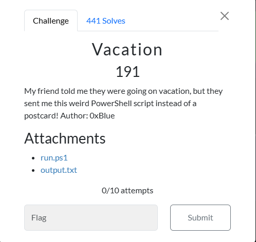

# Vacation



I clicked on`run.ps1`, which took me to a webpage that displayed:

```txt
$bytes = [System.Text.Encoding]::ASCII.GetBytes((cat .\flag.txt))
[System.Collections.Generic.List[byte]]$newBytes = @()
$bytes.ForEach({
    $newBytes.Add($_ -bxor 3)
    })
$newString =  [System.Text.Encoding]::ASCII.GetString($newBytes)
echo $newString | Out-File -Encoding ascii .\output.txt
```
I then clicked on `output.txt`, which took me to a webpage that displayed:

```txt
m33ayxeqln\sbqjp\twk\{lq~
```

I then asked ChatGPT to explain what the code is doing, line by line, and then summarize it. After I execute the prompt, this summary is returned:

```txt
Reads the contents of flag.txt.
Converts the content into an array of bytes.
Applies a bitwise XOR operation with the number 3 to each byte.
Converts the modified byte array back into a string.
Writes the resulting string to output.txt.
```

I then created a python file titled `vacation_solve.py` and began working:


```txt
# decodes the string by XORing each character by its ASCII value with 3 and then converts the resulting value back to a character
# Then adds the character to decrypted_string. Once that for loop as finished, prints decrypted_string
def decode(encoded_string):
	decrypted_string = ""
	for char in encoded_string:
		c = chr(ord(char) ^ 3)
		decrypted_string += c
	print(decrypted_string)
# function call
decode("m33ayxeqln\\sbqjp\\twk\\{lq~")
```

I then ran `vacation_solve.py`, which resulted in:

```txt
n00bz{from_paris_wth_xor}
```

I then submitted `n00bz{from_paris_wth_xor}`, and solved the challenge.

