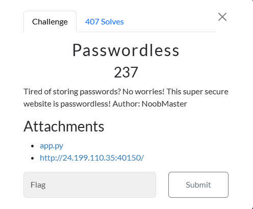
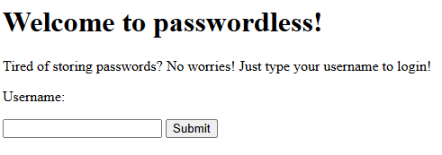
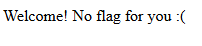
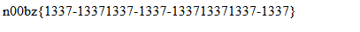

# Passwordless



I clicked on `app.py`, which took me to a webpage that contains:

```txt
#!/usr/bin/env python3
from flask import Flask, request, redirect, render_template, render_template_string
import subprocess
import urllib
import uuid
global leet

app = Flask(__name__)
flag = open('/flag.txt').read()
leet=uuid.UUID('13371337-1337-1337-1337-133713371337')

@app.route('/',methods=['GET','POST'])
def main():
    global username
    if request.method == 'GET':
        return render_template('index.html')
    elif request.method == 'POST':
        username = request.values['username']
        if username == 'admin123':
            return 'Stop trying to act like you are the admin!'
        uid = uuid.uuid5(leet,username) # super secure!
        return redirect(f'/{uid}')

@app.route('/<uid>')
def user_page(uid):
    if uid != str(uuid.uuid5(leet,'admin123')):
        return f'Welcome! No flag for you :('
    else:
        return flag

if __name__ == '__main__':
    app.run(host='0.0.0.0', port=1337)
```
I then clicked on `http://24.199.110.35:40150/`, which takes me to this website:


 
I enter "a" as my username, which results in:




I then glance to the top of the page, where I notice that the URL is:

```txt
24.199.110.35:40150/8a406be5-22f6-5340-9491-03cf301dcfdf
```

I then go back to `app.py`, where I notice:

```txt
def user_page(uid):
    if uid != str(uuid.uuid5(leet,'admin123')):
        return f'Welcome! No flag for you :('
    else:
        return flag
```
Now, if the UID doesn’t equal `str(uuid.uuid5(leet,’admin123’)), no flag will be sent. However, if the username equals admin123, the page will send `Stop trying to act like you are the admin!`. All I need to do is make a python script that prints out the UID for admin123. I am given the leet for admin123, which is `leet=uuid.UUID('13371337-1337-1337-1337-133713371337')`. So, I created a python file titled `passwordless_solve.py`, and began working:

```txt
import uuid
leet=uuid.UUID('13371337-1337-1337-1337-133713371337')
uid = str(uuid.uuid5(leet,'admin123'))
print(uid)
```

I then ran `passwordless_solve.py`, which resulted in:

```txt
3c68e6cc-15a7-59d4-823c-e7563bbb326c
```

I then go back to `http://24.199.110.35:40150/` and change the url to `24.199.110.35:40150/3c68e6cc-15a7-59d4-823c-e7563bbb326c`. I then execute the URL, which results in:



I then submitted `n00bz{1337-13371337-1337-133713371337-1337}`, and solved the challenge.

