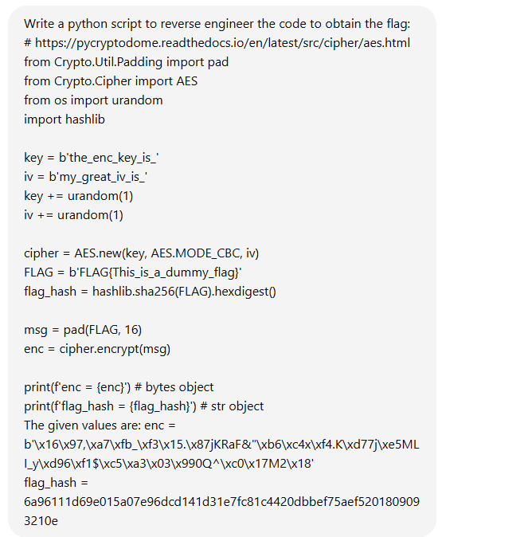
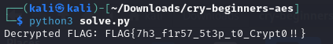

# beginners_aes


I download `cry-beginners-aes.zip` onto my Kali Linux VM. After downloading it, I unzip it. Inside the unzipped `cry-beginners-aes.zip` are two files: chall.py and output.txt. chall.py contains:

```txt
# https://pycryptodome.readthedocs.io/en/latest/src/cipher/aes.html
from Crypto.Util.Padding import pad
from Crypto.Cipher import AES
from os import urandom
import hashlib

key = b'the_enc_key_is_'
iv = b'my_great_iv_is_'
key += urandom(1)
iv += urandom(1)

cipher = AES.new(key, AES.MODE_CBC, iv)
FLAG = b'FLAG{This_is_a_dummy_flag}'
flag_hash = hashlib.sha256(FLAG).hexdigest()

msg = pad(FLAG, 16)
enc = cipher.encrypt(msg)

print(f'enc = {enc}') # bytes object
print(f'flag_hash = {flag_hash}') # str object
```

While output.txt contains:

```txt
enc = b'\x16\x97,\xa7\xfb_\xf3\x15.\x87jKRaF&"\xb6\xc4x\xf4.K\xd77j\xe5MLI_y\xd96\xf1$\xc5\xa3\x03\x990Q^\xc0\x17M2\x18'
flag_hash = 6a96111d69e015a07e96dcd141d31e7fc81c4420dbbef75aef5201809093210e
```

My strategy for any challenge that requires scripting (often crypto and web challenges) is to prompt ChatGPT to create a solve script for the challenge. If that doesn't work, I then use the solve script as a template to manually adjust as needed in order to solve the challenge. This saves me time while also causing my prompting skills to improve. Since AI is the future, being able to effectly write prompts that will return answers that actually work is paramount. However, this doesn't mean that ChatGPT can immediately solve any CTF challenge. It just means that the prompter must have the knowledge necessary to correctly tell ChatGPT what to do. ChatGPT is just another tool in my toolbox, and like any tool, it can either be effectively used or not. So I create a ChatGPT prompt:



Notice how I explicity state the code and the given values. After I executed my prompt, I recieved this script:

```txt
from Crypto.Util.Padding import unpad
from Crypto.Cipher import AES
import hashlib
import itertools

# Given values
enc = b'\x16\x97,\xa7\xfb_\xf3\x15.\x87jKRaF&"\xb6\xc4x\xf4.K\xd77j\xe5MLI_y\xd96\xf1$\xc5\xa3\x03\x990Q^\xc0\x17M2\x18'
flag_hash = "6a96111d69e015a07e96dcd141d31e7fc81c4420dbbef75aef5201809093210e"

# Known parts of key and IV
known_key_part = b'the_enc_key_is_'
known_iv_part = b'my_great_iv_is_'

# Function to decrypt with a given key and IV
def decrypt(enc, key, iv):
    cipher = AES.new(key, AES.MODE_CBC, iv)
    decrypted = cipher.decrypt(enc)
    try:
        return unpad(decrypted, AES.block_size)
    except ValueError:
        return None

# Brute-force the last byte of the key and IV
for key_byte in range(256):
    for iv_byte in range(256):
        key = known_key_part + bytes([key_byte])
        iv = known_iv_part + bytes([iv_byte])
        decrypted_flag = decrypt(enc, key, iv)
        if decrypted_flag:
            flag_hash_check = hashlib.sha256(decrypted_flag).hexdigest()
            if flag_hash_check == flag_hash:
                print(f"Decrypted FLAG: {decrypted_flag.decode()}")
                break
    else:
        continue
    break
```
I then copied and pasted the script into a python file, which I called `solve.py`. I then ran `solve.py`:



I then submitted `FLAG{7h3_f1r57_5t3p_t0_Crypt0!!}` and solved the challenge.
