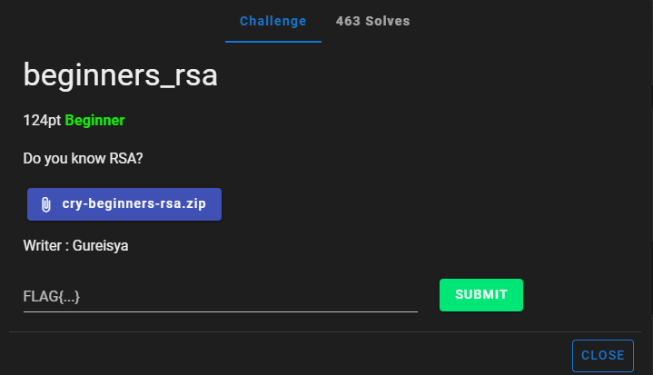
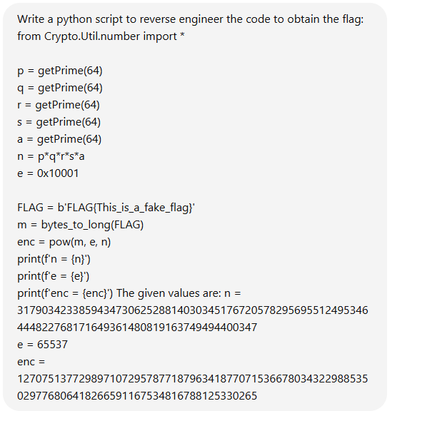
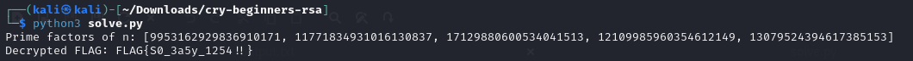

# beginners_rsa



I download `cry-beginners-rsa.zip` onto my Kali Linux VM. I then unzip it. Inside the unzipped `cry-beginners-rsa.zip`, there are two files: `chall.py` and `output.txt`. `chall.py` contains:

```txt
from Crypto.Util.number import *

p = getPrime(64)
q = getPrime(64)
r = getPrime(64)
s = getPrime(64)
a = getPrime(64)
n = p*q*r*s*a
e = 0x10001

FLAG = b'FLAG{This_is_a_fake_flag}'
m = bytes_to_long(FLAG)
enc = pow(m, e, n)
print(f'n = {n}')
print(f'e = {e}')
print(f'enc = {enc}')
```

While `output.txt` contains:

```txt
n = 317903423385943473062528814030345176720578295695512495346444822768171649361480819163749494400347
e = 65537
enc = 127075137729897107295787718796341877071536678034322988535029776806418266591167534816788125330265
```

I then craft this ChatGPT prompt, asking to reverse engineer `chall.py` to decode the original flag, and feeding it the values given in `output.txt`:



I then execute the prompt, resulting in this script, which I copy and paste onto a python file named `solve.py`:

```txt
from Crypto.Util.number import long_to_bytes
from sympy import factorint

# Given values
n = 317903423385943473062528814030345176720578295695512495346444822768171649361480819163749494400347
e = 65537
enc = 127075137729897107295787718796341877071536678034322988535029776806418266591167534816788125330265

# Step 1: Factorize n
factors = factorint(n)
primes = list(factors.keys())
print(f"Prime factors of n: {primes}")

# Check if we have 5 primes as expected
if len(primes) != 5:
    raise ValueError("n does not factorize into exactly 5 prime numbers.")

p, q, r, s, a = primes

# Step 2: Compute φ(n)
phi_n = (p - 1) * (q - 1) * (r - 1) * (s - 1) * (a - 1)

# Step 3: Compute d (modular inverse of e modulo φ(n))
def modinv(a, m):
    m0, x0, x1 = m, 0, 1
    while a > 1:
        q = a // m
        m, a = a % m, m
        x0, x1 = x1 - q * x0, x0
    if x1 < 0:
        x1 += m0
    return x1

d = modinv(e, phi_n)

# Step 4: Decrypt the message
m = pow(enc, d, n)
FLAG = long_to_bytes(m)
print(f"Decrypted FLAG: {FLAG.decode()}")
```

I then run `solve.py`:



I then submit `FLAG{S0_3a5y_1254!!}` and solve the challenge. This challenge was almost exactly the same as `beginners_aes`, with the only difference being that the encryption scheme is rsa instead of aes. 

