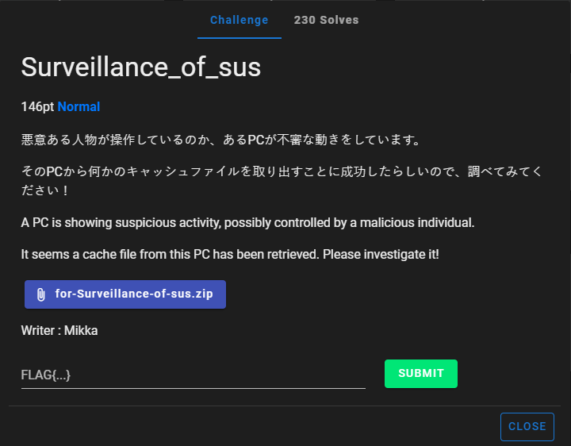
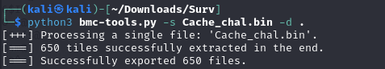

# Surveillance_of_sus



I download `for-Surveillance-of-sus.zip` onto my Kali Linux VM and unzip it. The unzipped `for-Surveillance-of-sus.zip` contains one file: `Cache_chal.bin`. In order to view the readable contents of the `.bin` file, I execute

```txt
strings Cache_chal.bin
```

which outputs:

```txt
RDP8bmp
i2\@
kaSDr@
:kQ@
{b`R
.Nw@
*kj:
Ah1@
&6F;|
SrK"
A       R@
x7mT@
6$IY
O z@
DCe"s@
m4m@
"8^<
wB3-
CuT@
~ sn@
otY@
y%c@
FY#@
cOyU@
t#V!
k0_w1
.0>@
#TxY
s?O@
A*3/
gAC=
2}|X@
y']W@
e<in
#.A@
N       v6
%64Ju
lsp@
<(E@
f4edet
T*z@
`CLn
/>5)
h\3@
~ayV]
+*sWz@
)ngj
[x@@
{EW@
>-0L
o8A>
O9-?
```

The `RDP8bmp` at the top indicates that `Cache_chal.bin` is a `bmp` file that has been outputted to be a `.bin` file. In order to extract the images from the `.bin` file, I use `bmc-tools` created by ANSSI-FR. I then type: 

```txt
python3 bmc-tools.py -s Cache_chal.bin -d .
```
Which instructs bmc-tools.py to extract images from Cache_chal.bin and output them in the current directory, represented by `.`. I then run the command, which results in:



650 images is way too much for me to inspect individually, so I then delete the files that have been created by my command. I then type:

```txt
python3 bmc-tools.py -s Cache_chal.bin -d . -b
```

Which instructs bmc-tools.py to output the extracted images, while also
