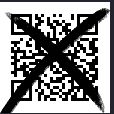

# codebreaker

I download `for-codebreaker.zip` onto my Kali Linux VM and unzip it. The unzipped `for-codebreaker.zip` contains one file: `chal_codebreaker.png`. `chal_codebreaker.png` displays:

At first I tried to see if I could remove the X from the QR code, but all my efforts were in vain. So instead I reconstructed what I could from the image using `merri.cx/qrazybox/`'s QR code editor:

Here is what it looks like outside the editor:

I then navigated to the `tools` section of the page, and selected `Extract QR Information`, which resulted in:

I then went to `binaryhexconverter.com`'s Binary to ASCII converter, and copied and pasted `final data bits` into the input box, which resulted in:

Oh no. So I then went back to the tools section, and tried `Reed-Solomon Decoder`:

I pressed `decode`, which resulted in:

I then submitted `FLAG{How_scan-dalous}` and solved the challenge.
