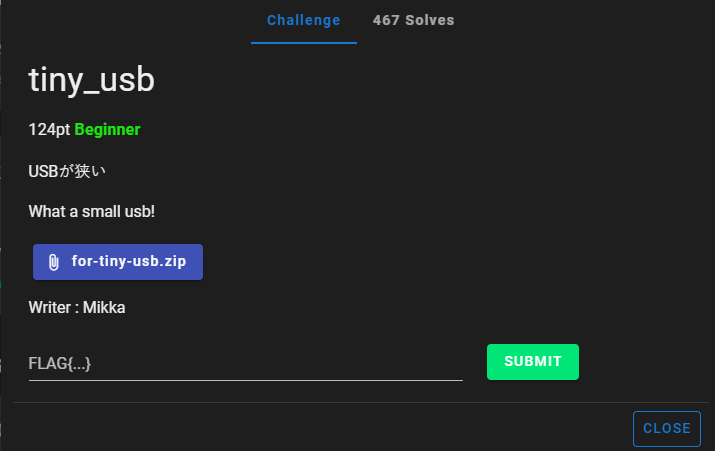
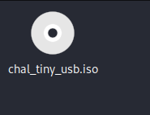
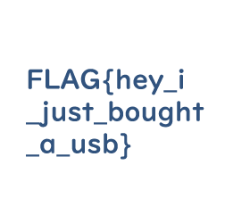

# tiny_usb

I download `for-tiny-usb.zip` onto my Kali Linux VM and unzip it, which reveals:

I then double-click `chal_tiny_usb` to open it, which contains `FLAG.PNG`. I then open `FLAG.PNG`, which displays:

I then submit `FLAG{hey_i_just_bought_a_usb}` and solve the challenge.
