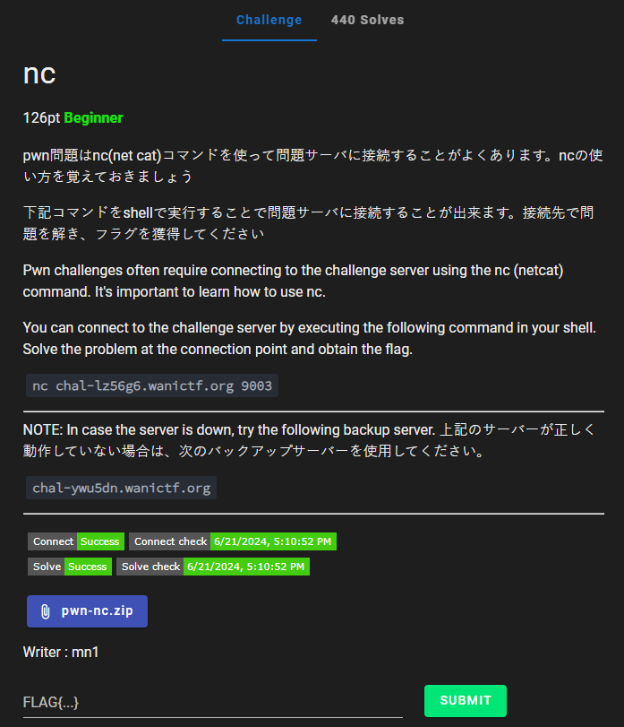
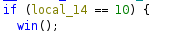
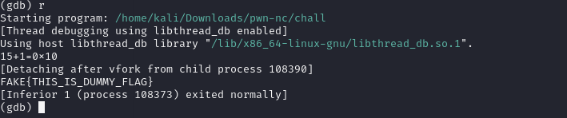
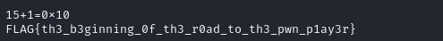

# nc



I download `pwn-nc.zip` onto my Kali Linux VM and unzip it. The unzipped `pwn-nic.zip` contains one file: a excutable file known as `chall`, `main.c`, `FLAG.txt`, and `makefile`. `FlAG.txt` contains a fake flag, so I import `chall` into Ghidra and browse through it's dissasembled code. While browsing through, I notice:



Seems like `local_14` has to equal 10. So I run `chall` using gdb. I am prompted:

```txt
15+1 = 0x
```

Where after the 0x I am able to input. Out of curiousity I enter:

```txt
15+1 = 0x10
```

And submit it, which results in:



Turns out 0x10 is hex for 16. 15 + 1 = 16 so thats whay 0x10 was the answer. However since this was running on my system and not the server, the flag provided is a fake flag. So, I type:

```txt
nc chal-lz56g6.wanictf.org 9003
```

which connects to the server. When the same prompt comes up, I enter 10, which results in:



I then submit `FLAG{th3_b3ginning_0f_th3_r0ad_to_th3_pwn_p1ay3r}` and solve the challenge. 


