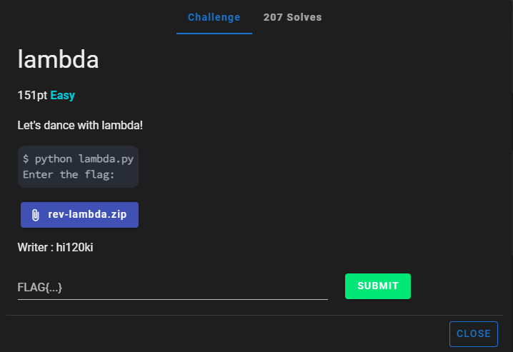
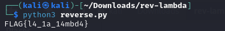

# lambda


I download `rev-lambda.zip` onto my Kali Linux VM and unzip it. The unzipped `rev-lambda.zip` contains one file, `lambda.py`. `lambda.py` contains:

```txt
import sys

sys.setrecursionlimit(10000000)

(lambda _0: _0(input))(lambda _1: (lambda _2: _2('Enter the flag: '))(lambda _3: (lambda _4: _4(_1(_3)))(lambda _5: (lambda _6: _6(''.join))(lambda _7: (lambda _8: _8(lambda _9: _7((chr(ord(c) + 12) for c in _9))))(lambda _10: (lambda _11: _11(''.join))(lambda _12: (lambda _13: _13((chr(ord(c) - 3) for c in _10(_5))))(lambda _14: (lambda _15: _15(_12(_14)))(lambda _16: (lambda _17: _17(''.join))(lambda _18: (lambda _19: _19(lambda _20: _18((chr(123 ^ ord(c)) for c in _20))))(lambda _21: (lambda _22: _22(''.join))(lambda _23: (lambda _24: _24((_21(c) for c in _16)))(lambda _25: (lambda _26: _26(_23(_25)))(lambda _27: (lambda _28: _28('16_10_13_x_6t_4_1o_9_1j_7_9_1j_1o_3_6_c_1o_6r'))(lambda _29: (lambda _30: _30(''.join))(lambda _31: (lambda _32: _32((chr(int(c,36) + 10) for c in _29.split('_'))))(lambda _33: (lambda _34: _34(_31(_33)))(lambda _35: (lambda _36: _36(lambda _37: lambda _38: _37 == _38))(lambda _39: (lambda _40: _40(print))(lambda _41: (lambda _42: _42(_39))(lambda _43: (lambda _44: _44(_27))(lambda _45: (lambda _46: _46(_43(_45)))(lambda _47: (lambda _48: _48(_35))(lambda _49: (lambda _50: _50(_47(_49)))(lambda _51: (lambda _52: _52('Correct FLAG!'))(lambda _53: (lambda _54: _54('Incorrect'))(lambda _55: (lambda _56: _56(_41(_53 if _51 else _55)))(lambda _57: lambda _58: _58)))))))))))))))))))))))))))
```

I then craft a ChatGPT prompt that asks to reverse engineer the code to obtain the flag, which I send to ChatGPT. ChatGPT then sends back this script, which I copy and paste into a python file that I created and named `reverse.py`: 

```txt
def refine_reverse_engineer(encoded_str):
    # Step 1: Base 36 to integer, add 10, then convert to character
    parts = encoded_str.split('_')
    decoded_chars = [chr(int(c, 36) + 10) for c in parts]
    
    # Step 2: XOR with 123 transformation
    xor_decoded = ''.join(chr(123 ^ ord(c)) for c in decoded_chars)
    
    # Step 3: Add 3 to each character's ordinal value (reverse of subtract 3)
    ord_decoded_plus3 = ''.join(chr(ord(c) + 3) for c in xor_decoded)
    
    # Step 4: Subtract 12 from each character's ordinal value (reverse of add 12)
    original_string = ''.join(chr(ord(c) - 12) for c in ord_decoded_plus3)
    
    return original_string

# Encoded string from the given code
encoded_str = '16_10_13_x_6t_4_1o_9_1j_7_9_1j_1o_3_6_c_1o_6r'
flag = refine_reverse_engineer(encoded_str)
print(flag)
```

I then run `reverse.py` using the command:

```txt
python3 reverse.py
```

Which results in:



I then submit `FLAG{l4_1a_14mbd4}` and solve the challenge.


