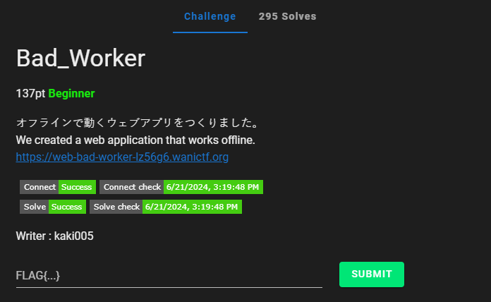
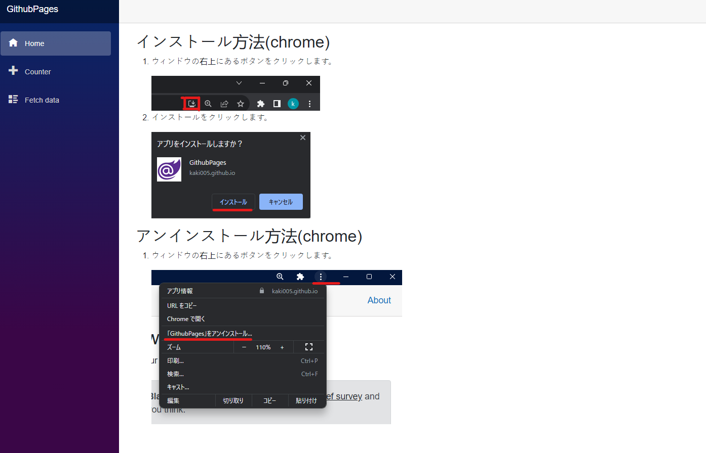
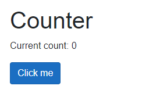
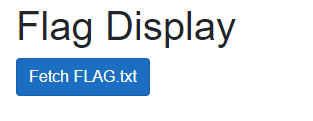
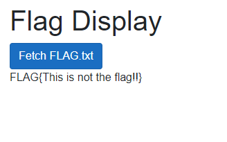
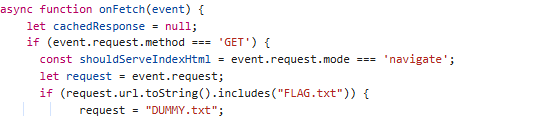
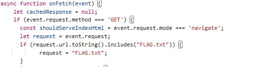
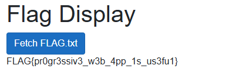

# Bad_Worker

I click on the link, which takes me to this page:

I then navigate to the `Counter` tab:

Where I can click a button to count. I then navigate to the `Fetch Data` tab:

I then click `Fetch FLAG.txt`, which reveals:

Aw man! I fake flag. So I then open DevTools and navigate to the sources tab, where I notice:

I wonder what would happen if I change `DUMMY.txt` to `FLAG.txt`. So I follow the instructions to run the website on my system (as detailed in the first page that is displayed when reaching the website), and modify `DUMMY.txt` to:

I then click `Fetch FLAG.txt` again, which results in:

I then submit `FLAG{pr0gr3ssiv3_w3b_4pp_1s_us3fu1}` and solve the challenge.
