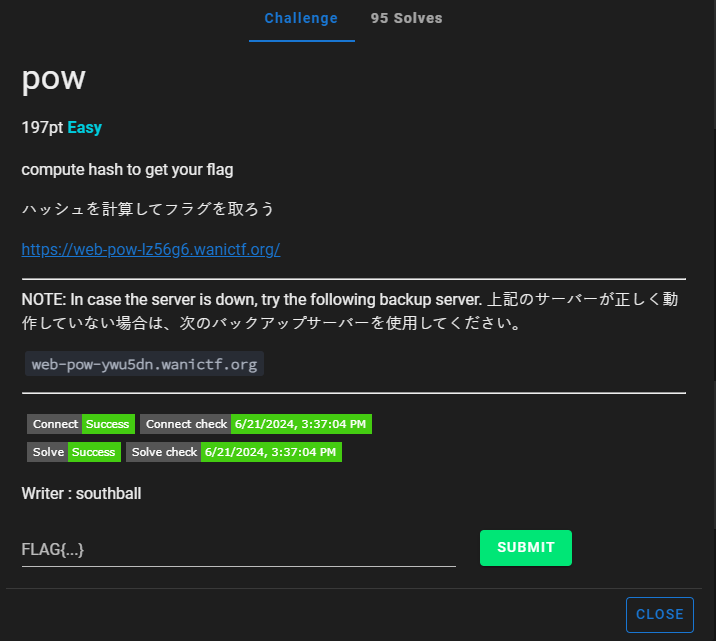
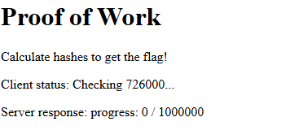
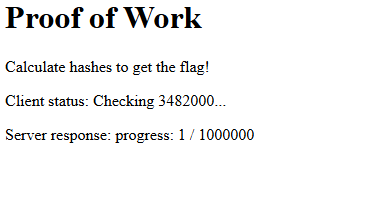
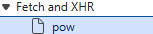
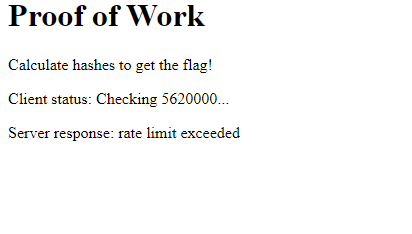
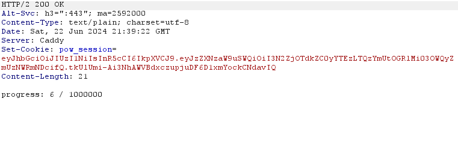

# pow



I click on the link, which takes me to this website:



After some time, the website changes to:



I open Edge DevTools, and in the network tab I notice:



I resend `pow` again, which results in:


I then interecept the `pow` request in Burpsuite (by running the Burpsuite browser and waiting). I then go to `Intruder` and set the request to run 1,000,000 times. I then launch my intruder, which works for a couple requests until:



Oh. So I clear the website cookies and try again. I wait until I have 3/1,000,000


When I wonder to myself "what would happen if I duplicated the number inside of the `pow` request 2 times?" So, I copy and paste `7844289` two times to make an array of 3 items:


I send the request, which results in:



I then create a python script that writes the string “7844289” to output.txt (with double quotations), puts a comma at the end of it, and repeats this process for as many times as specified:

```
