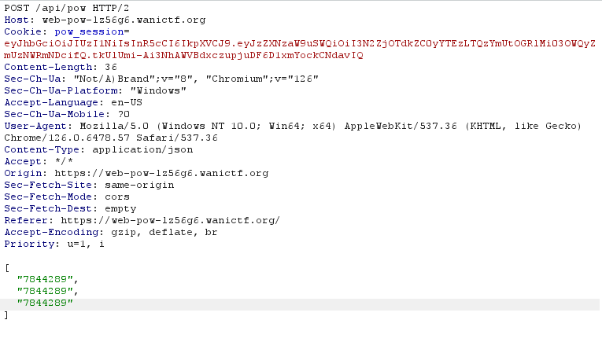
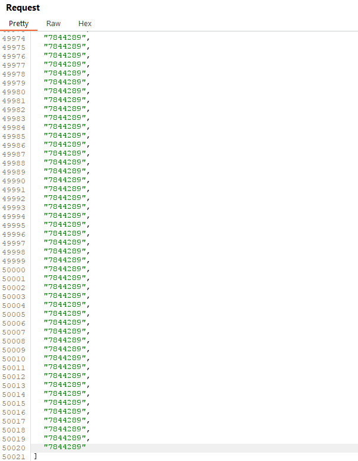

# pow


I click on the link, which takes me to this website:


After some time, the website changes to:


I open Edge DevTools, and in the network tab I notice:


I resend `pow` again, which results in:


I then interecept the `pow` request in Burpsuite (by running the Burpsuite browser and waiting). I then go to `Intruder` and set the request to run 1,000,000 times. I then execute Intruder, which works for a couple requests until:


Oh. So I clear the website cookies and try again. I wait until I have 3/1,000,000:


I think to myself "what would happen if I duplicated the number inside of the `pow` request 2 times?" So, I copy and paste `7844289` two times to make an array of 3 items:



I send the request, which results in:


I then create a python script that writes the string “7844289” to output.txt (with double quotations), puts a comma at the end of it, and repeats this process for as many times as specified:

```txt
def repeat_string_to_file(string, times, filename):
    result = [f'"{string}",'] * times
    with open(filename, 'w') as file:
        for item in result:
            file.write(f"{item}\n")


string = "7844289"
times =  
filename = 'output.txt'
repeat_string_to_file(string, times, filename)
print(f"Output written to {filename}")
```

Which I name `repeater.py`. I set `times` to 50,000 and run `repeater.py`, which outputs `output.txt`. I then copy and paste the text in `output.txt` into my Burpsuite request:



And send it. I then send it again after 10 seconds. Eventually, I max out the progress by making the progress number reach 1,000,000, which results in:


I then submit `FLAG{N0nCE_reusE_i$_FUn}` and solve the challenge.
